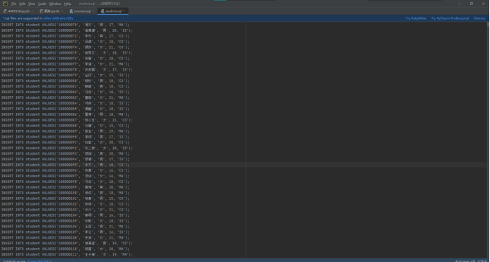
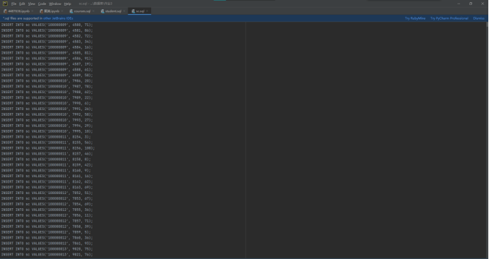

## 报告标题：实验数据准备
## 学号：19200132
## 姓名：郭俊杰
## 日期：2022-10-30

# 一、实验环境
1.操作系统：Windows 10
2.数据库管理软件(含版本号)：PostgresSQL 14.6
3.其他工具：IntelliJ IDEA 2022.10、Java 11

# 二、实验内容及其完成情况
## 1、实验准备
语言选择：Java语言（需要下载JDBC驱动）
驱动下载：!()[Pasted image 20221031132906.png]

## 2、准备数据
数据生成方式：Java自动随机生成
其中分别生成100万条student记录，1万条course记录和1000万条sc记录。
### Java生成代码如下：
#### ①产生一百万条student表记录：
```Java
1. public static void RandomStudentFile(int size, File output) {  

2.         initNames();  

3.         Random rand = new Random();  

4.         rand.setSeed(new Date().getTime());  

5.   

6.         try (BufferedWriter bw = new BufferedWriter(  

7.                 new OutputStreamWriter(  

8.                         new FileOutputStream(output),  

9.                         Charset.forName("utf-8")))) {  

10.             for (int i =0; i < size; i++) {  

11.                 int nameID = Math.abs(rand.nextInt()) % Names.size();  

12.                 int SSexID = Math.abs(rand.nextInt()) % Sex.size();  

13.                 int Age = rand.nextInt() % 4 + 18;  

14.                 int DeptID = Math.abs(rand.nextInt()) % Dept.size();  

15.                 bw.write(String.format(InsertStudent,  

16.                         "'"+String.valueOf(100000000 + i)+"'",  

17.                         "'"+Names.get(nameID)+"'",  

18.                         "'"+Sex.get(SSexID)+"'",  

19.                         String.valueOf(Age),  

20.                         "'"+Dept.get(DeptID)+"'")+"\n");  

21.                 if (i % 10000 == 0) {  

22.                     bw.flush();  

23.                 }  

24.             }  

25.   

26.         } catch (FileNotFoundException e) {  

27.             e.printStackTrace();  

28.         } catch (IOException e) {  

29.             e.printStackTrace();  

30.         }  

31.     }
```
#### ②产生course表一万条记录：
```Java
1. public static void RandomCourseFile(int size, File output) {  

2.         initNames();  

3.         Random rand = new Random();  

4.         rand.setSeed(new Date().getTime());  

5.   

6.

7.         try (BufferedWriter bw = new BufferedWriter(  

8.                 new OutputStreamWriter(  

9.                         new FileOutputStream(output),  

10.                         Charset.forName("utf-8")))) {  

11.             for (int i = 0; i < Courses.size(); i++) {  

12.                 Course c = Courses.get(i);  

13.                 bw.write( String.format(InsertCourse,  

14.                         String.valueOf(i+1),  

15.                         "'"+c.getCName()+"'",  

16.                         c.getCPno(),  

17.                         c.getCCredit())+"\n");  

18.             }  

19.             for (int i =Courses.size(); i < size; i++) {  

20.                 int CNameID = Math.abs(rand.nextInt()) % Courses.size();  

21.                 Course c = Courses.get(CNameID);  

22.                 bw.write( String.format(InsertCourse,  

23.                         String.valueOf(i+1),  

24.                         "'"+c.getCName()+"'",  

25.                         c.getCPno(),  

26.                         c.getCCredit())+"\n");  

27.                 if (i % 10000 == 0) {  

28.                     bw.flush();  

29.                 }  

30.             }  

31.   

32.         } catch (FileNotFoundException e) {  

33.             e.printStackTrace();  

34.         } catch (IOException e) {  

35.             e.printStackTrace();  

36.         }  

37.     }
```
#### ③生成sc表一百万条记录：
```Java
1. public static void RandomSCFile(int size, File output ,File logFile) {  

2.         initNames();  

3.         Random rand = new Random();  

4.         rand.setSeed(new Date().getTime());  

5.   

6.         try (BufferedWriter bw = new BufferedWriter(  

7.                 new OutputStreamWriter(  

8.                         new FileOutputStream(output),  

9.                         Charset.forName("utf-8")))  

10.         ) {  

11.             FileWriter fw = new FileWriter(logFile);  

12.             for (int id = 100000000; id < 100000000 + 1000000; id++) {  

13.                 int CourseId = Math.abs(rand.nextInt()) % 10000 + 1;  

14.                 for (int c = 0; c < 10; c++) {  

15.                     int grades = Math.abs(rand.nextInt()) % 101;  

16.                     bw.write(String.format(InsertSC,  

17.                             "'"+String.valueOf(id)+"'",  

18.                             String.valueOf((CourseId + c)%10000 + 1),  

19.                             String.valueOf(grades))+"\n");  

20.                 }  

21.                 if (id % 10000 == 0) {  

22.                     System.out.println(id);  

23.                     bw.flush();  

24.                 }  

25.             }  

26.         } catch (FileNotFoundException e) {  

27.             e.printStackTrace();  

28.         } catch (IOException e) {  

29.             e.printStackTrace();  

30.         }  

31.     }
```
### 最终生成数据结果如下图:
#### (1)student.sql

#### (2)course.sql

#### (3)sc.sql


## 3、插入数据
### (1)使用SQL Shell在数据库postgres分别创建表Student、Course和SC。

#### ①创建Student表

 

#### ②创建Course表

 

#### ③创建SC表

 

#### ④查看创建结果


### (2)使用Java工具进行插入操作
#### ①插入代码如下：
```Java
1. static void InsertFromFile(Connection connection , File file, File logFile) throws 
SQLException {  

2.         try (Scanner sc = new Scanner(new FileInputStream(file));  

3.              FileWriter fw = new FileWriter(logFile)){  

4.   

5.             Statement statement = connection.createStatement();  

6.             long start = System.currentTimeMillis();  

7.             long pre = System.currentTimeMillis();  

8.             int times = 0;  

9.             int nums = 1;  

10.             while (sc.hasNextLine()) {  

11.                 String sql = sc.nextLine();  

12.                 statement.execute(sql);  

13.                 times++;  

14.                 if (times % 100000 == 0) {  

15.                     long now = System.currentTimeMillis();  

16.                     fw.append(String.valueOf(now - pre) + "\n");  

17.                     System.out.println(String.valueOf((nums-1)*10000)+"~"  

18.                             +String.valueOf(nums*10000)+"->"  

19.                             +String.valueOf(now - pre) + "ms");  

20.                     nums++;  

21.                     pre = now;  

22.                 }  

23.             }  

24.             long end = System.currentTimeMillis();  

25.             System.out.println("total:" + String.valueOf(end-start) + "ms");  

26.         } catch (FileNotFoundException e) {  

27.             e.printStackTrace();  

28.         } catch (IOException e) {  

29.             e.printStackTrace();  

30.         }  

31.     }
```
#### ②插入耗时：
Student插入耗时（一百万条记录）：117s


Course插入耗时（一万条记录）：1.4s


Sc插入耗时（一千万条记录）：1484s


### (3)检查插入结果，通过pgadmin4检查插入结果
#### ①使用sql指令SELECT * FROM student查询student表中数据
 

#### ②使用sql指令SELECT * FROM courset查询course表中数据
 

#### ③使用sql指令SELECT * FROM sc查询sc表中数据
 

#### ④三个表中记录条数查询：使用sql指令SELECT COUNT(*) FROM 各表查询三个表格表中记录个数

student表：
 

course表：
 

sc表：


#### 三张表运行速度图表：

①student
 

② course
 

③sc


# 三、实验总结
此次实验相比之前的实验来说难度较大，完成所花费的时间也较长。
此次实验对于我来说受益匪浅，不仅让我更加熟悉了Java编程语言与数据库之间的链接操作以及随机生成数据的方法，除此之外，对于数据库的操作的理解也更上一层楼，让我更熟悉了Shell操作数据库以及admin两种形式。
